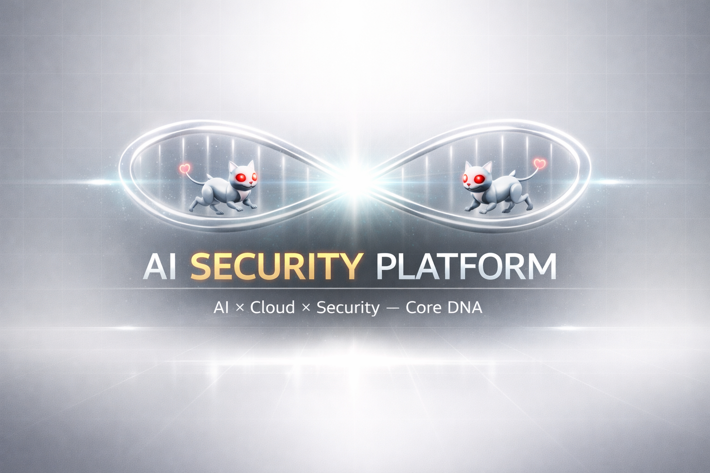
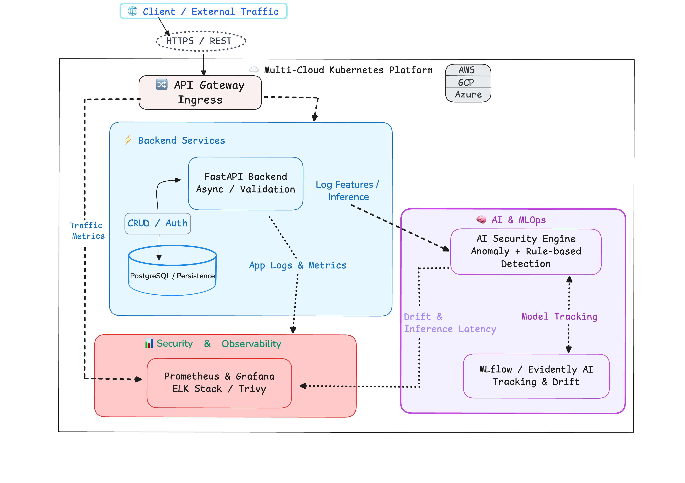

<p align="center">
 
</p>

<p align="center"><sub><strong>AI × Cloud × Security — Core DNA</strong></sub></p>

<p align="center">
  
  
  
  
  
  
  
</p>

<p align="center">
  <a href="./ROADMAP.ja.md"><strong>📘 技術ロードマップ</strong></a>
</p>

<p align="center">
  <a href="./README.md">🌐 English Version</a>
</p>

# AI Security Platform: Backend & Infrastructure ▣

本プロジェクトは、**AI駆動型（AI-driven）**のログ異常検知から**自律型セキュリティエージェント**への進化を目的とした、実務レベルのAIバックエンドおよびクラウドネイティブ・セキュリティ設計のショーケースとして、以下の要素に重点を置いています。

- **推論レイテンシの最適化**
- **モデルドリフトの監視（精度劣化の検知）**
- **Kubernetesベースのオーケストレーション**
- **OWASP基準に準拠した要塞化（Hardening）**

マルチクラウド環境でのグローバル展開を見据え、AI駆動型の異常検知から自律的な防御アクションまでを一貫して管理する、**AI Backend Engineer**としての設計・実装力を証明します。

---

## 📍 現在のステータス: [Phase 1 - AI異常検知 & ハイブリッド検知 🚧]
Phase 0 の FastAPI 基盤構築は完了し、現在は Phase 1: AI異常検知 & ハイブリッド検知エンジン の実装を進めています。

現在の `POST /analyze` エンドポイントでは特徴量エンジニアリング、
異常スコアリング、ルールベース検知、しきい値評価を組み合わせたリアルタイム分析を行います。
直近では、既知の攻撃パターンに対応するため、Regex-based の SQL Injection detection および Directory Traversal detection を追加しました。
また、`RuleEvaluationResult` と `RuleMatchInfo` により
どのルールが、どのフィールドで、どのパターンに一致したのかを追跡できる設計にしています。


### 🔄 直近のアップデート
- **完了**: Phase 0 FastAPI基盤、Pydanticバリデーション、構造化ログ。
- **実装済み**: `POST /analyze` によるリアルタイム分析フロー。
- **実装済み**: Regex-based の **SQL Injection detection** および **Directory Traversal detection**
- **実装済み**: `RuleEvaluationResult` / `RuleMatchInfo` によるルール評価結果の構造化。
- **進行中**: 異常検知モデルの改善、推論レイテンシ最適化、Decision Context の拡張。
- **予定**: Request ID 伝搬、Shadow Mode、Redis による状態ベース検知。

---
## 💠 プロジェクトの4つの柱
- **AI/ML**: ログ解析による異常検知と、自律的なレスポンス（Agent化）。
- **Backend**: FastAPIによる非同期、高性能なAPIサーバー。
- **Infrastructure**: Docker/Kubernetesを用いたコンテナオーケストレーション。
- **Security & SRE**: 脆弱性対策、エラー率・モデル精度のモニタリング。

---

### 🧬 プロジェクトの進化 (10-Phase Roadmap)
* **Phase 0-1**: API基盤構築、AI異常検知、ハイブリッド検知の基礎 (FastAPI, Scikit-learn, Rule-based Detection)
* **Phase 2-3**: APIの堅牢化とコンテナセキュリティ (JWT, RBAC, Trivy, SBOM)
* **Phase 4-6**: K8s運用と自律型レスポンス (Prometheus, Network Policies)
* **Phase 7-10 (クラウド & グローバルスケールへの拡張)**: 
    * **AWS**: **Terraform** による IaC 本番環境構築と EKS 運用。
    * **GCP**: Vertex AI と BigQuery ML を活用した高度な **MLOps**。
    * **Azure**: エンタープライズセキュリティと **LLM (Advanced LLM)** によるログ解析統合。
    * **Global**: マルチリージョン冗長化、カオスエンジニアリング、**FinOps** の導入。

> **各フェーズの詳細なタスクについては、[ROADMAP.ja.md](./ROADMAP.ja.md) をご参照ください。**

## 🔭 長期ビジョン

本プロジェクトは最終的に、**自律型クラウドネイティブAIセキュリティプラットフォーム**へと進化することを目指します。
- リアルタイムでの**脅威検知と自律的な対応**
- AWS / GCP / Azure を跨いだ**本番運用レベルの可用性**の確保
- LLMを活用した**インシデントの要約と説明可能性（Explainability）**の提供
- マルチリージョン冗長化と**継続学習によるグローバル展開に対応可能なスケーラブルなプラットフォーム**への発展

この長期ビジョンをより具体的な技術方針に落とし込んだものが、以下の図です。
本プロジェクトが将来的に到達を目指す **ターゲットアーキテクチャ** の全体像を示しています。

## 📡 ターゲットアーキテクチャ

この図は、バックエンドサービス、AI/ML、オブザーバビリティ（可観測性）、
およびインフラ基盤全般における今後の開発の指針となる、
最終的なシステム設計（エンドステート・デザイン）を示しています。

<p align="center">
  
</p>

## 🔍 アーキテクチャの構成解剖：疎結合コンポーネントによる設計思想 (Architecture Breakdown)

- **API Gateway / Ingress**: 外部トラフィックの終端と、内部プラットフォームへのセキュアなL7ルーティングを担う玄関口。
- **Backend Services (FastAPI)**: 非同期I/Oによる高スループットなAPI基盤。リクエスト検証から認証・認可、PostgreSQLへの永続化に至るまで、プラットフォーム中核のビジネスロジックを一括して統制。
- **AI Security Engine**: プラットフォーム全体の安全性をリアルタイムに保証する中核コンポーネント。ストリームログから特徴量を解析し、不審なパターンの特定および異常検知・脅威スコアリングを統合的に実行
- **MLOps & Tracking (MLflow / Evidently AI)**: モデルの挙動、推論レイテンシ、精度ドリフトを監視し、信頼性の高いAI運用サイクルを確立。
- **Observability Stack**: Prometheus, Grafana, ELK, Trivyを活用し、メトリクスやセキュリティシグナルまで、システム全体のエンドツーエンドな可視化を実現。

## 🛠 技術スタック

**技術スタックの全体像:**
本スタックは、将来のプラットフォームの成長性と拡張性、および柔軟性を確保しつつ、長期的にアーキテクチャを支えるよう設計されています。
現在稼働しているコア技術と、次フェーズ以降に導入予定の戦略的ツールを統合した構成となっています。

### 🟢 Active（フェーズ 0–1：稼働中）
*基盤構築およびAI実装において、現在使用している主要技術です。*

- **Python 3.12**: バックエンド開発、MLパイプライン、セキュリティ分析を支える主要言語。
- **FastAPI**: リクエスト検証、ルーティング、API処理を担う非同期・高性能APIフレームワーク。
- **Pydantic v2**: API入出力のスキーマ検証とデータ整合性の担保。
- **構造化ロギング（Structured Logging）**: AIによる解析や可観測性ワークフローを前提に設計された、JSONベースのログ基盤。
- **AI Security Engine（Isolation Forestベース）**: 現在は、異常スコアリングとルールベース検知を組み合わせ、既知攻撃パターンと統計的な異常の両方を評価するハイブリッド検知フローを構築しています。
- **Rule-based Security Detection**: SQL Injection や Directory Traversal などの既知攻撃パターンを Regex-based rules で検知。
- **Traceable Rule Evaluation**: `RuleEvaluationResult` / `RuleMatchInfo` により、検知理由・一致パターン・対象フィールドを追跡可能にする設計。
- **MLflow**: フェーズ1の学習プロセスにおける実験トラッキングとモデルバージョン管理。
- **Pytest**: 単体テストおよび統合テストのためのテスト基盤。
- **Ruff**: 一貫したコード品質を維持するための高速なリンターおよびフォーマッター。
- **GitHub Actions（CI/CD-ready）**: テストとリントを自動化し、後続フェーズでのデプロイ自動化も見据えたパイプライン設計。

### 🔘 Planned（フェーズ 2–10：計画中）
*プラットフォームの進化に合わせて順次導入予定の戦略的技術群です。*

#### フェーズ 2 — セキュリティ ＆ 永続化
- **PostgreSQL**: 認証情報、CRUD操作、および構造化ログを保存するための信頼性の高いリレーショナルDB。
- **Alembic**: スキーマ進化を管理するためのデータベース・マイグレーションツール。
- **Passlib / JWT**: セキュアなパスワードハッシュ化とトークンベース認証。
- **RBAC**: 堅牢な認可を実現するロールベースアクセス制御。

#### フェーズ 3 — コンテナセキュリティ
- **Trivy**: コンテナイメージおよび依存関係の脆弱性スキャン。
- **python:3.12-slim**: 攻撃対象領域を最小化し、イメージを軽量化するベースイメージ。
- **pip-audit / safety**: 依存関係の整合性確認と脆弱性検証。
- **SBOM Tooling**: 透明性とサプライチェーン可視化のためのソフトウェア部品構成表（SBOM）生成。
- **Hardened GitHub Actions**: サプライチェーン攻撃を防ぐためのセキュアなCIパイプライン設計。

#### フェーズ 4 — SRE ＆ 可観測性
- **Evidently AI**: モデルドリフト検知と推論品質の監視。
- **Prometheus / Grafana**: メトリクス収集、可視化、およびアラート通知。
- **ELK Stack**: 運用状況を可視化するための分散ログ集約と検索基盤。

#### フェーズ 5 — Kubernetes ＆ クラウドネイティブ
- **Kubernetes（kind → EKS / GKE）**: ローカル環境からクラウド環境へ拡張していくオーケストレーション基盤。
- **Ingress Controller + TLS**: セキュアなL7トラフィック管理とHTTPS終端。
- **Network Policies / Pod Security Standards**: 最小特権原則に基づくランタイム保護。
- **HPA（Horizontal Pod Autoscaling）**: 推論負荷に応じたPodの自動スケーリング。
- **Kubernetes Secrets / Vault**: シークレットおよび認証情報の管理。

#### フェーズ 6 — AIエージェント統合
- **自律型レスポンス層（Autonomous Response Layer）**: AI駆動によるIPブロックやSlack通知などの自動アクション。
- **Backend + AI + Infra の統合**: 検知、意思決定、自動対応をつなぐ完全な運用ループの構築。

#### フェーズ 7 — AWS 統合
- **Terraform**: VPC、EKS、RDSなどのプロビジョニングを自動化する Infrastructure as Code（IaC）。
- **ALB Ingress Controller / ACM / IRSA**: 本番運用向けのIngress、証明書管理、IAM連携。
- **CloudWatch**: AWSネイティブなログおよびメトリクス監視基盤。

#### フェーズ 8 — GCP 統合
- **Vertex AI**: マネージドなモデルレジストリと推論サービング。
- **BigQuery ML**: セキュリティデータに対する大規模分析ワークフロー。
- **GCS**: 特徴量ベクトルや機械学習関連アーティファクトの保存先。

#### フェーズ 9 — Azure 統合
- **Azure OpenAI**: LLMを活用したログ要約と説明可能性の強化。
- **Microsoft Entra ID**: エンタープライズ向けアイデンティティ管理とSSO統合。
- **Microsoft Sentinel**: 脅威ハンティングと調査のためのSIEM統合。

#### フェーズ 10 — マルチリージョン対応アーキテクチャ
- **マルチリージョン構成**: リージョンをまたいだフェイルオーバーと高可用性の実現。
- **カオスエンジニアリング**: 制御された障害注入によるレジリエンス検証。
- **FinOps ツール**: スポットインスタンス活用やスケーリング制御によるコスト最適化。
- **継続的学習パイプライン**: モデルの継続改善と適応型セキュリティを実現するオンライン・フィードバック・ループ。

---

## ⚡ クイックスタート (Local Environment)
手元の環境でAPIを起動するための最小構成です。
※Phase 7以降のAWS/Terraformデプロイ手順は、今後のフェーズで専用ディレクトリに追加されます。

```bash
git clone https://github.com/millalisredyaid/ai-security-platform.git
cd ai-security-platform
pip install -r requirements.txt
python -m uvicorn app.main:app --reload
```

APIドキュメント

`http://127.0.0.1:8000/docs`

## 🧪 Setup & Usage

ローカル開発環境の詳細なセットアップ手順です。

### 1. ローカル環境の構築

```bash
python -m venv venv
source venv/bin/activate  # Windowsの場合: venv\Scripts\activate
pip install -r requirements.txt
```

### 2. 環境変数の設定 (`.env`)

```bash
cp .env.example .env
```

必要に応じて値を編集してください。

### 3. 開発サーバーの起動

```bash
python -m uvicorn app.main:app --reload
```

※ 開発環境では `--reload` を付けて起動します。
本番運用やコンテナ環境では、プロセスマネージャーやASGIサーバー設定に応じて `app.main:app` を指定します。

ブラウザで以下のURLにアクセスすると、APIドキュメントを確認できます。

`http://127.0.0.1:8000/docs`

### 4. オプション: 開発用ロギングの有効化

環境変数を使用する場合:
```bash
export LOG_LEVEL=DEBUG
export LOG_FORMAT=json
```

`.env`を使用する場合:
```bash
LOG_LEVEL=DEBUG
LOG_FORMAT=json
```

### 5. 追加のセットアップ (今後のフェーズ)

プラットフォームの進化にあわせて、追加のセットアップ手順を順次ここに追記していきます。

## 🗺 ロードマップ
開発は段階的なフェーズに分けて管理されており、各フェーズで「実務での課題解決」をテーマに機能を拡張しています。
詳細はROADMAPをご覧ください。
- **[ROADMAP.ja.md (Japanese Roadmap)](./ROADMAP.ja.md)** 
- **[ROADMAP.md (English)](./ROADMAP.md)**
---
